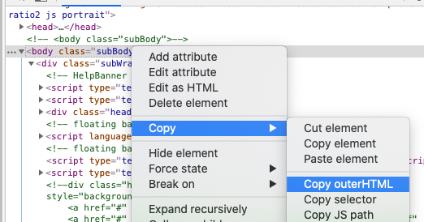
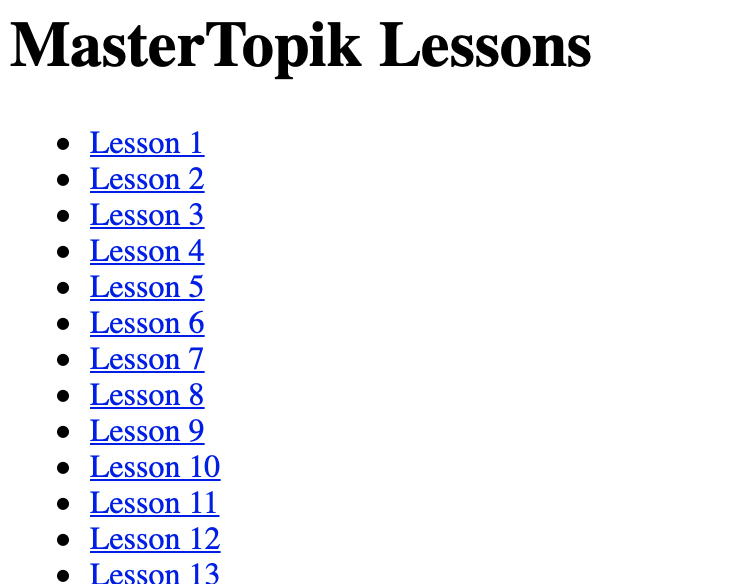

# Watch mastertopik lessons on iPad

As you probably know if you got here, mastertopik lessons seem to only work for Windows and Android devices, as in iPad their website doesn't seem to use the right deep link into StarPlayer+ (the proprietary player application that you need to use to watch it on iOS).

This little script recreates the deep links and outputs a static webpage that you can open from your Files app, and it contains all the correct links to each lesson.

## How to use it

You'll need a working Python installation, the `requests` package, and the script in this repo:

```bash
git clone https://github.com/txus/mastertopik
cd mastertopik
pip install requests
```

First, open Chrome and go to your Online classroom on mastertopik:


Then, open the Chrome Developer Tools (Option + Command + J) and copy the contents of the `body` tag to your clipboard like this:



Now, go to where you have downloaded the script and run:

```bash
pbpaste | python main.py > urls.html
```

It will create an `urls.html` file that you can copy to your iCloud Drive (`cp urls.html ~/Documents` should be enough).

Then from your iPad, go to the Files app, open the Documents folder on iCloud Drive, and click on `urls.html`. You should see the urls, click on them, accept and it will open StarPlayer+ automatically at the right video.


